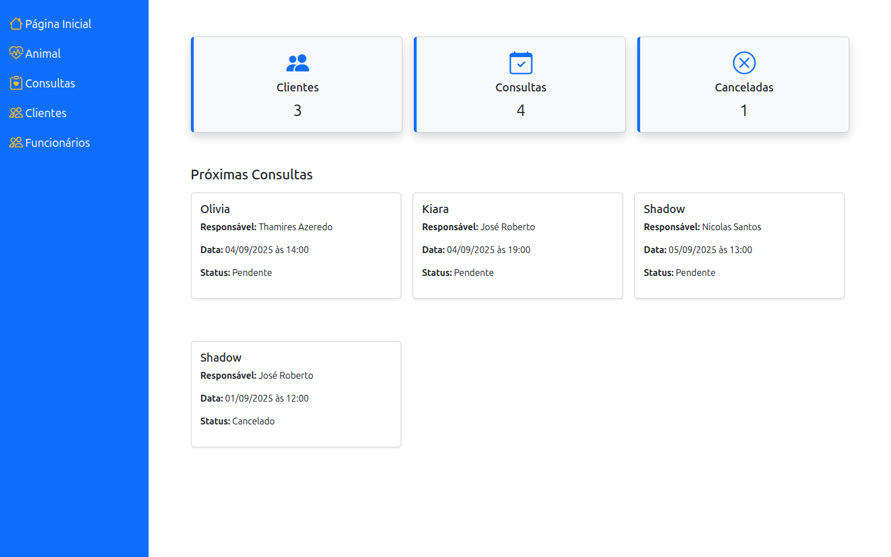
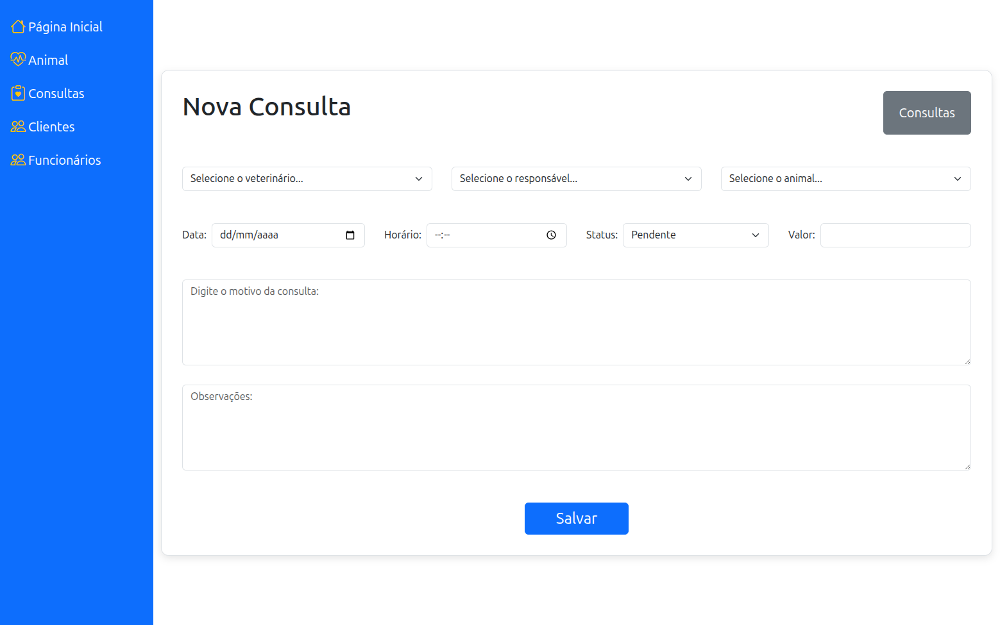
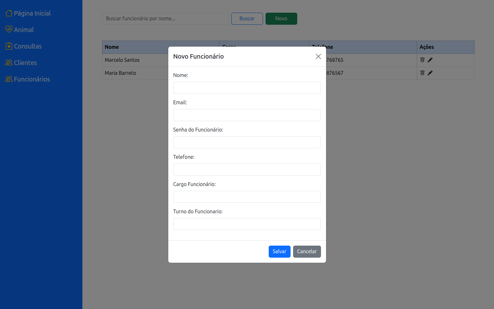
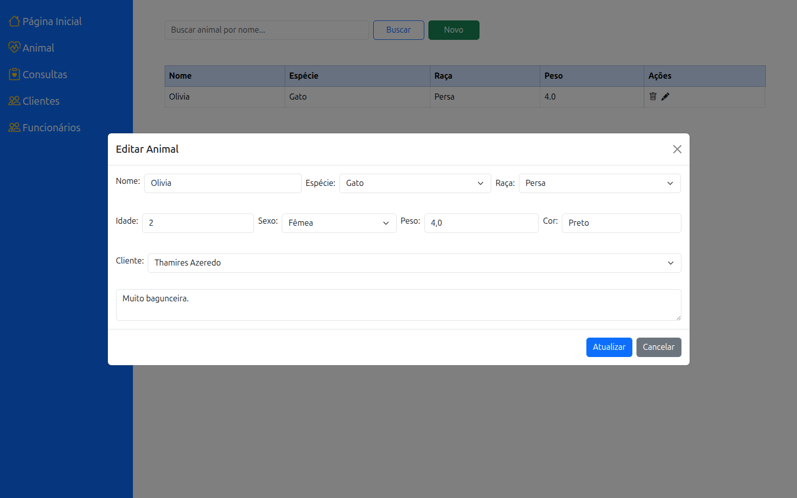

# 🐾 SGVET - Sistema de Gerenciamento Veterinário


## 📌 Sobre o Projeto

O **SGVET** (Sistema de Gerenciamento Veterinário) é uma aplicação desenvolvida em **Java com Spring Boot**, utilizando o padrão **MVC** para organização da aplicação e **APIs REST** para funcionalidades dinâmicas.  

O sistema foi projetado para auxiliar clínicas veterinárias no gerenciamento de **clientes, funcionários, animais e consultas**, oferecendo um fluxo de trabalho **organizado, moderno e eficiente**.

---

## 🚀 Funcionalidades

- **CRUD completo** (criar, visualizar, editar e excluir) para:
  - 🧑‍⚕️ Funcionários
  - 👥 Clientes
  - 🐶 Animais
  - 📅 Consultas
- **Página inicial** com visão geral da clínica:
  - Próximas consultas
  - Informações resumidas (quantidade de clientes, consultas e cancelamentos)
- **Interface dinâmica** utilizando a API criada para atualização de dados sem recarregar toda a página.
- **Organização clara** com modais para cadastro e edição de dados.

---

## 🖼️ Demonstração

### 📊 Tela Inicial
Aqui é possível visualizar as próximas consultas e alguns indicadores da clínica.



### 📅 Nova Consulta
Modal para cadastrar uma nova consulta, vinculando cliente, animal e responsável.



### 🧑‍⚕️ Cadastro de Funcionário
Modal para criação de um novo funcionário.



### 🐶 Edição de Animal
Exemplo de edição de dados de um animal já cadastrado.



---
## 🏗️ Arquitetura

O projeto foi desenvolvido com base no padrão **MVC (Model-View-Controller)**:

- **Model** → Representa as entidades principais (Cliente, Funcionário, Animal, Consulta).
- **View** → Construída com **Thymeleaf** + **HTML/CSS/JS**, com páginas dinâmicas e interativas.
- **Controller** → Camada responsável por orquestrar regras de negócio e expor **APIs REST**.

---

## ⚙️ Tecnologias Utilizadas

- **Java 17**
- **Spring Boot 3**
  - Spring MVC
  - Spring Data JPA
  - Spring Web
- **Thymeleaf** (para renderização de páginas dinâmicas)
- **Bootstrap 5** (estilização responsiva e modais)
- **JavaScript Vanilla** (manipulação de DOM e integração com API via Fetch)
- **H2 Database** (para desenvolvimento e testes)
- **Maven** (gerenciamento de dependências)

---

## 💻 Como Executar

1. **Clonar o repositório**
   ```bash
   git clone https://github.com/liviapessanha/programacao-web.git
   cd programacao-web``

2. **Rodar a aplicação com Maven**
   ```bash
   ./mvnw spring-boot:run
   ```

     **Se estiver no Windows**
     ```bash
       mvnw.cmd spring-boot:run
     ```

 4. **Acessar o navegador**
   http://localhost:8080
